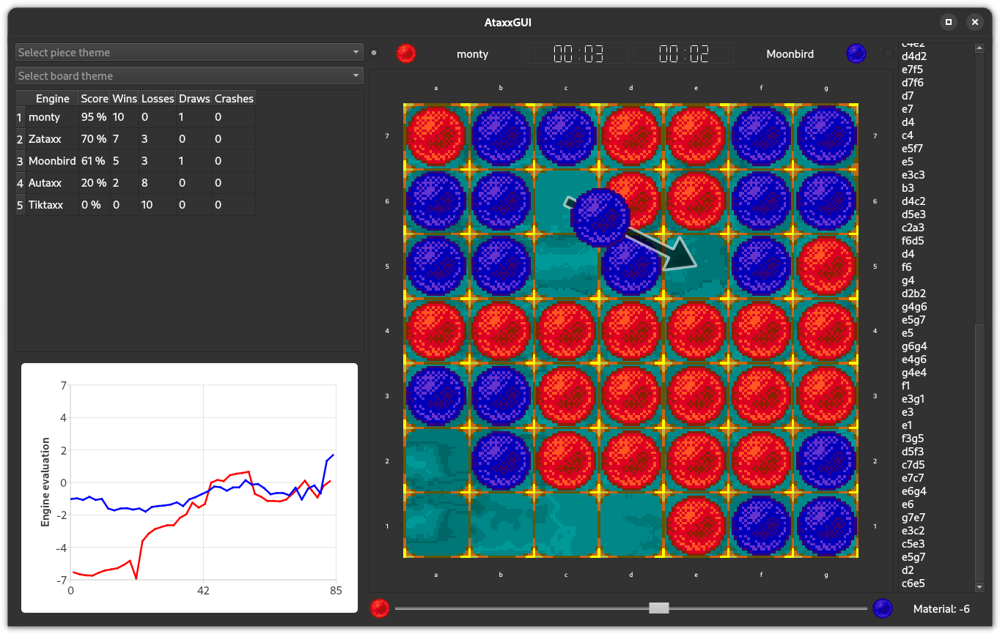

<div align="center">
<p><h1>AtaxxGUI</h1>
<i><h4>A graphical user interface for playing Ataxx between engines and humans</h4></i>

</h1>
</div>

## Compile

You need to install Git, CMake, a C++ compiler, Boost, and Qt6. TODO qt-charts

On Ubuntu you can do that like this (there will be similar packages for most Linux distros):
```bash
sudo apt install git cmake g++ libboost-dev qt6-base-dev qt6-charts-dev
```

### Linux

```bash
git clone https://github.com/tsoj/AtaxxGUI.git
cd AtaxxGUI
mkdir build
cd build
export CXX=g++
cmake .. && make -j
```

### Windows

There are binaries for Windows available under releases.

```bash
git clone https://github.com/tsoj/AtaxxGUI.git
cd AtaxxGUI
mkdir build
cd build
cmake ..
msbuild .\AtaxxGUI.sln /p:Configuration=Release
# If you want to distribute:
windeployqt.exe ..\bin\AtaxxGUI.exe
```


## Credits

- A lot of the board visualization in [src/boardview/](src/boardview/) is taken and modified from [Cute Chess](https://github.com/cutechess/cutechess)
- [Cuteataxx](https://github.com/kz04px/cuteataxx) and [libataxx](https://github.com/kz04px/libataxx) by kz04px
- [Lidraughts](https://github.com/RoepStoep/lidraughts) and [Lichess](https://github.com/lichess-org/lila) for some of the board and piece themes
- The inventors of Ataxx
- The engine programming community
